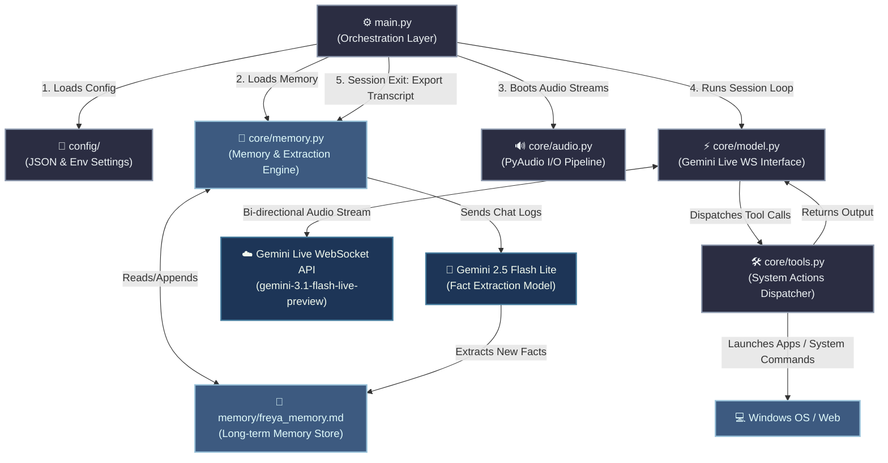

# 🪐 Freya v3 Architecture

Welcome to the internal blueprint of **Freya v3**, an advanced, real-time AI voice assistant engineered with Google's Gemini Live API. This document details the component hierarchy, data flow pathways, and operational design patterns that power Freya.

---

## 🛰️ System Topology

Freya is structured as a modular, event-driven architecture designed to minimize latency and ensure smooth audio pipeline execution.

---

## ⚡ Core Subsystems

### 1. Orchestration Layer (`main.py`)
The system bootstrap manager. It is responsible for:
- Initializing configuration paths and loading environment variables (e.g., API keys).
- Bootstrapping the PyAudio microphone and speaker streams.
- Reading historical memory facts and weaving them into the base personality prompt.
- Initializing the live session loop and handling clean shutdowns (closing audio streams, triggering memory updates).

### 2. Audio I/O Engine (`core/audio.py`)
A low-latency wrapper around **PyAudio** that manages raw audio hardware interfacing.
*   **Microphone Stream (`MicStream`)**: Captures audio input at **16kHz (PCM, 16-bit Mono)** as required by Gemini Live.
*   **Speaker Stream (`SpeakerStream`)**: Receives processed model responses at **24kHz (PCM, 16-bit Mono)** and writes them straight to the audio hardware output buffer.

### 3. Connection & Event Loop (`core/model.py`)
This is the heart of Freya's real-time interaction, using the asynchronous `google-genai` SDK:
- **WebSocket Loop**: Initiates a persistent bi-directional connection using `aio.live.connect`.
- **Concurrent Task Runners**:
  1. `send_audio()`: Continuously reads frames from the microphone buffer and pushes them as audio chunks to Gemini.
  2. `receive_audio()`: Listens for incoming socket responses. Logs voice transcriptions (both input and output) and parses functional payloads.
  3. `play_audio()`: Pulls incoming model speech chunks from an internal queue and writes them to the speaker stream.
- **State Management**: Intercepts `turn_complete` events and model speaking states to mute/unmute microphone input, preventing echo loops.

### 4. Memory & Context Engine (`core/memory.py` & `memory/`)
Allows Freya to build a long-term profile of the user (Ihan) without databases:
- **Dynamic Context Injection**: Prior to session startup, `freya_memory.md` is read and appended to the model's system instructions.
- **Transcript Collector**: Gathers all spoken text lines throughout the conversation.
- **Automatic Summary & Fact Update**: Upon shutdown, Freya sends the collected transcript and existing memory file to `gemini-2.5-flash-lite`. The model extracts new preferences, updates the history, and appends the new facts directly back to `freya_memory.md`.

### 5. Tool Integration Subsystem (`core/tools.py`)
Freya is empowered with **15 operating system and web-integrated capabilities** exposed to Gemini via function declarations:

| Tool Name | Parameters | Action |
| :--- | :--- | :--- |
| `open_app` | `name` | Launches configured applications (Valorant, Photoshop, VS Code, etc.). |
| `close_app` | `name` | Terminates process trees using Windows `TASKKILL`. |
| `web_search` | `query` | Opens search terms in the default browser. |
| `play_youtube` | `query` | Direct search play inside YouTube. |
| `get_news` | `topic` | Pulls headlines via Google News query. |
| `shutdown_computer`| `delay_seconds`| Executes a timed system shutdown. |
| `take_screenshot` | *None* | Captures desktop screenshot using PyAutoGUI. |
| `open_folder` | `name` | Opens Explorer mapping paths from configuration. |
| `get_weather` | `city` | Retrieves live city reports from `wttr.in`. |
| `set_reminder` | `message`, `minutes` | Schedules a system notification thread. |
| `search_docs` | `technology`, `query`| Queries official framework docs. |
| `explain_error` | `error_text` | Searches StackOverflow and opens debug links. |
| `open_project` | `project_name` | Opens designated coding workspace in VS Code. |
| `run_terminal_command`| `command` | Runs developer utility commands with output validation. |
| `search_stackoverflow`| `query` | Resolves programming queries via StackExchange API. |

---

## 🛠️ Data Flow Lifecycle

1.  **Audio Input**: Mic audio is captured -> Buffered -> Streamed to Gemini Live WebSocket.
2.  **API Processing**: Gemini processes audio -> Evaluates system instructions + context memory -> Decides to return audio response or fire a Tool.
3.  **Tool Dispatch**: If a tool is called, the session waits -> `core/tools.py` executes local function -> Result sent back to Gemini via WebSocket -> Gemini resumes speech generation.
4.  **Audio Output**: Gemini streams audio packets back -> Queued -> Written to SpeakerStream -> Played to user.
5.  **Shutdown**: Session ends -> Logs analyzed by Gemini -> Memory file appended.