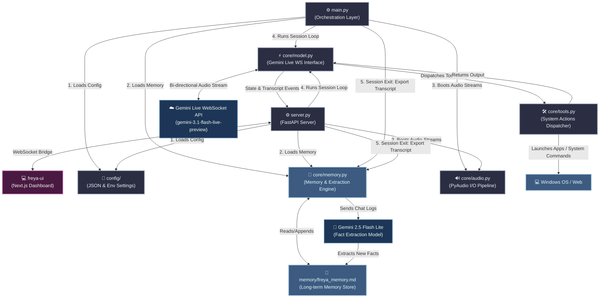

# 🪐 Freya v3 Architecture

Welcome to the internal blueprint of **Freya v3**, an advanced, real-time AI voice assistant engineered with Google's Gemini Live API. This document details the component hierarchy, data flow pathways, and operational design patterns that power Freya's dual-process architecture.

---

## 🛰️ System Topology

Freya is structured as a modular, event-driven architecture designed to minimize latency and ensure smooth audio pipeline execution. The system consists of a **Python backend** (FastAPI + Gemini Live WebSocket + PyAudio) and an optional **Next.js frontend** connected via a local WebSocket bridge.

---

## ⚡ Core Subsystems

### 1. Dual Entry Points

Freya supports two execution modes that share the same core engine:

| | CLI Mode (`main.py`) | Web UI Mode (`server.py`) |
| :--- | :--- | :--- |
| **Interface** | Terminal stdout/stdin | Browser dashboard at `localhost:3000` |
| **Backend** | Direct `asyncio.run()` | FastAPI + Uvicorn on port 8000 |
| **State Updates** | Console `print()` statements | WebSocket broadcast to all connected UI clients |
| **Session Control** | `Ctrl + C` to stop | Start/Stop button in dashboard |
| **Config Changes** | Edit `freya_config.json` manually | Live model/voice switching via Settings modal |
| **Memory Editing** | Edit `freya_memory.md` manually | In-browser memory editor |

#### `main.py` — CLI Orchestrator
The headless system bootstrap. Initializes config, memory, audio streams, and the `FreyaModel` session loop. On `KeyboardInterrupt`, it cleanly shuts down audio streams and triggers the memory update pipeline.

#### `server.py` — FastAPI + WebSocket Server
The web-enabled orchestrator that wraps the same core engine with:
- **REST endpoints**: `POST /start`, `POST /stop`, `GET /status`, `GET /config`, `POST /config`, `GET /memory`, `POST /memory`
- **WebSocket endpoint** (`/ws`): Pushes real-time `state`, `transcript`, and `tool` events to all connected dashboard clients. Supports auto-reconnection.
- **`FreyaModelWithBroadcast`**: A subclass of `FreyaModel` that overrides `on_transcript()`, `on_tool()`, and `on_state()` hooks to broadcast events to the frontend via WebSocket.

### 2. Audio I/O Engine (`core/audio.py`)
A low-latency wrapper around **PyAudio** that manages raw audio hardware interfacing.
*   **Microphone Stream (`MicStream`)**: Captures audio input at **16kHz (PCM, 16-bit Mono)** as required by Gemini Live. Uses `exception_on_overflow=False` to gracefully handle buffer overruns without crashing.
*   **Speaker Stream (`SpeakerStream`)**: Receives processed model responses at **24kHz (PCM, 16-bit Mono)** and writes them straight to the audio hardware output buffer.
*   Both streams accept configurable `device_index` parameters, bound from `config/freya_config.json`.

### 3. Connection & Event Loop (`core/model.py`)
This is the heart of Freya's real-time interaction, using the asynchronous `google-genai` SDK:
- **WebSocket Loop**: Initiates a persistent bi-directional connection using `client.aio.live.connect()`.
- **Three Concurrent Task Runners** (via `asyncio.gather`):
  1. `send_audio()`: Reads mic frames via `run_in_executor` (non-blocking) and pushes them as `audio/pcm;rate=16000` blobs to Gemini. Automatically mutes when `model_speaking` event is set, preventing echo.
  2. `receive_audio()`: Listens for incoming socket responses. Handles three payload types:
     - **Tool calls**: Dispatches to `core/tools.py`, sends results back to Gemini via `send_tool_response()`.
     - **Transcription**: Buffers Freya's output transcription fragments and emits full sentences on `turn_complete`. User input transcription is emitted immediately.
     - **Audio data**: Queues `inline_data` chunks for playback.
  3. `play_audio()`: Pulls queued audio chunks and writes them to the speaker stream via `run_in_executor` (non-blocking).
- **State Machine**: The `model_speaking` `asyncio.Event` controls mic muting. Set when audio data arrives from the model; cleared on `turn_complete`. Override hooks (`on_state`, `on_transcript`, `on_tool`) allow subclasses to broadcast events.
- **Live Config**: `LiveConnectConfig` enables `AUDIO` response modality, configurable voice presets, system instruction injection, and bi-directional audio transcription.

### 4. Memory & Context Engine (`core/memory.py` & `memory/`)
Allows Freya to build a long-term profile of the user without databases:
- **Dynamic Context Injection**: Prior to session startup, `freya_memory.md` is read and appended to the model's system instructions via `build_system_prompt()`.
- **Transcript Collector**: A `TranscriptCollector` class gathers all spoken text lines throughout the conversation as `"Speaker: text"` formatted strings.
- **Automatic Summary & Fact Update**: Upon shutdown, Freya sends the collected transcript and existing memory file to `gemini-2.5-flash-lite`. The model extracts new preferences, writes a dated bullet-point summary, and appends it directly back to `freya_memory.md`. Includes retry logic with exponential backoff for rate-limited API calls (up to 3 attempts).
- **Minimum Threshold**: Sessions with fewer than 3 transcript lines are skipped to avoid noise.

### 5. Tool Integration Subsystem (`core/tools.py`)
Freya is empowered with **15 operating system and web-integrated capabilities** exposed to Gemini via function declarations:

| Tool Name | Parameters | Action |
| :--- | :--- | :--- |
| `open_app` | `name` | Launches configured applications (Valorant, Photoshop, VS Code, etc.). |
| `close_app` | `name` | Terminates process trees using Windows `TASKKILL /F /IM`. |
| `web_search` | `query` | Opens search terms in the default browser via Google. |
| `play_youtube` | `query` | Direct search play inside YouTube. |
| `get_news` | `topic` | Opens Google News for the given topic. |
| `shutdown_computer`| `delay_seconds`| Executes a timed system shutdown via `shutdown /s /t`. |
| `take_screenshot` | *None* | Captures desktop screenshot using PyAutoGUI, saves to Desktop. |
| `open_folder` | `name` | Opens Explorer mapping paths from configuration. |
| `get_weather` | `city` | Retrieves live city weather from `wttr.in` (no API key needed). |
| `set_reminder` | `message`, `minutes` | Schedules a Windows Forms notification on a background thread. |
| `search_docs` | `technology`, `query`| Queries official framework docs (Python, React, Docker, FastAPI, etc.). |
| `explain_error` | `error_text` | Searches StackOverflow for error diagnosis. |
| `open_project` | `project_name` | Opens designated coding workspace in VS Code. |
| `run_terminal_command`| `command` | Runs safe developer utility commands with 15s timeout and output trimming. Blocks dangerous commands (`rm`, `del`, `format`, `shutdown`, etc.). |
| `search_stackoverflow`| `query` | Resolves programming queries via StackExchange API, opens top result. |

All tools are dispatched through a central `dispatch()` router function called by `FreyaModel.receive_audio()` when Gemini issues a function call.

### 6. Web Dashboard (`freya-ui/`)
A **Next.js 16** single-page application built with **React 19** and **Tailwind CSS 4**, providing a cyberpunk-themed mission control interface.

| Component | File | Purpose |
| :--- | :--- | :--- |
| **Main Page** | `app/page.tsx` | Dashboard layout with 12-column grid: metadata sidebar, central standby area with start/stop button, and archival panel. |
| **WebSocket Hook** | `app/hooks/useFreyaSocket.ts` | React hook managing WebSocket connection to `ws://localhost:8000/ws`. Handles state, transcript buffering, tool logs, config fetching, and memory CRUD. Auto-reconnects on disconnect (2s retry). |
| **Archival Panel** | `app/components/ArchivalPanel.tsx` | Tabbed panel with live transcript feed, tool execution log, and memory viewer. |
| **Settings Modal** | `app/components/SettingsModal.tsx` | Modal for switching Gemini models, voice presets, and editing the memory file. |
| **Activity Indicator** | `app/components/ActivityIndicator.tsx` | Animated status indicator reflecting Freya's current state (idle/listening/speaking). |

**Transcript Buffering**: The frontend buffers Freya's streaming transcription fragments and only renders the complete sentence when a `state: "listening"` event signals turn completion, preventing fragmented UI updates.

---

## 🛠️ Data Flow Lifecycle

1.  **Session Init**: Config loaded → Memory read → System prompt assembled → Audio streams opened → Gemini Live WebSocket connection established.
2.  **Audio Input**: Mic audio captured at 16kHz → Offloaded to executor thread → Streamed to Gemini as PCM blobs (muted during model speech).
3.  **API Processing**: Gemini processes audio → Evaluates system instructions + context memory → Decides to return audio response or fire a tool.
4.  **Tool Dispatch**: If a tool is called → `core/tools.py` executes the local function → Result sent back to Gemini via `send_tool_response()` → Gemini resumes speech generation.
5.  **Audio Output**: Gemini streams audio packets back → Queued in `asyncio.Queue` → Written to SpeakerStream via executor thread → Played to user.
6.  **State Broadcast** (Web UI mode): State transitions, transcripts, and tool events are broadcast to all connected WebSocket clients in real-time.
7.  **Shutdown**: Session ends → Audio streams closed → Transcript analyzed by `gemini-2.5-flash-lite` → Memory file appended with new facts and session summary.

---

## 🔌 API Surface (server.py)

| Method | Endpoint | Description |
| :--- | :--- | :--- |
| `POST` | `/start` | Start the Freya voice session |
| `POST` | `/stop` | Stop the active session, trigger memory update |
| `GET` | `/status` | Returns `{ "running": bool }` |
| `GET` | `/config` | Returns active model, voice, available models/voices |
| `POST` | `/config` | Update active model or voice |
| `GET` | `/memory` | Returns the raw memory file content |
| `POST` | `/memory` | Overwrites the memory file with provided content |
| `WS` | `/ws` | Real-time event stream: `state`, `transcript`, `tool` messages |