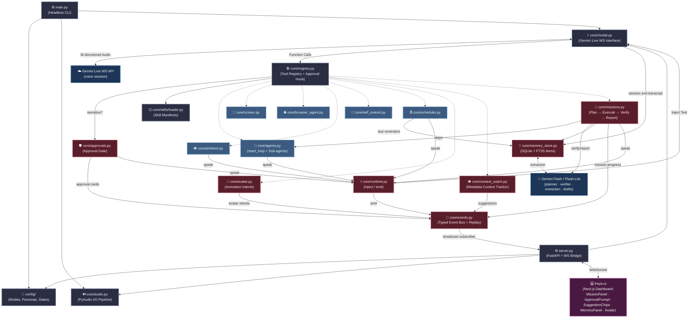

# 🪐 Freya v3 Architecture

Welcome to the internal blueprint of **Freya v3**, an advanced, real-time AI voice agent engineered with Google's Gemini Live API. This document details the component hierarchy, data flow pathways, and operational design patterns that power Freya's dual-process architecture.

---

## 🛰️ System Topology

Freya is structured as a modular, event-driven architecture designed to minimize latency and ensure smooth audio pipeline execution. The system consists of a **Python backend** (FastAPI + Gemini Live WebSocket + PyAudio) and an optional **Next.js frontend** connected via a local WebSocket bridge.

```mermaid
graph TD
    %% Entry points
    Main["⚙️ main.py<br>(Headless CLI)"]
    Server["⚙️ server.py<br>(FastAPI + WS Bridge)"]
    UI["💻 freya-ui<br>(Next.js Dashboard:<br>MissionPanel · ApprovalPrompt ·<br>SuggestionChips · MemoryPanel · Avatar)"]
    Config["📁 config/<br>(Modes, Personas, Gates)"]

    %% Core engine
    AudioEngine["🔊 core/audio.py<br>(PyAudio I/O Pipeline)"]
    ModelEngine["⚡ core/model.py<br>(Gemini Live WS Interface)"]
    RegDispatcher["🛠️ core/registry.py<br>(Tool Registry + Approval Hook)"]
    SkillLoader["⌬ core/skills/loader.py<br>(Skill Manifests)"]

    %% Platform layer (v4)
    EventBus["📡 core/events.py<br>(Typed Event Bus + Replay)"]
    Approvals["🛡️ core/approvals.py<br>(Approval Gate)"]
    Missions["🎯 core/missions.py<br>(Plan → Execute → Verify → Report)"]
    Avatar["💃 core/avatar.py<br>(Animation Intents)"]
    MemoryStore["🧠 core/memory_store.py<br>(SQLite + FTS5 Items)"]
    ContextWatch["👁️ core/context_watch.py<br>(Metadata Context Tracker)"]
    Runtime["⚡ core/runtime.py<br>(inject / emit)"]

    %% Existing superpowers
    Agents["🤖 core/agents.py<br>(react_loop + Sub-agents)"]
    Screen["🎯 core/screen.py"]
    BrowserAgent["🌐 core/browser_agent.py"]
    Ambient["👁️ core/ambient.py"]
    SelfExtend["🧬 core/self_extend.py"]
    Scheduler["⏰ core/scheduler.py"]

    %% External
    GeminiLive["☁️ Gemini Live WS API<br>(voice session)"]
    GeminiText["🧠 Gemini Flash / Flash-Lite<br>(planner · verifier · extraction · drafts)"]

    %% Flows
    Main --> Config
    Main --> AudioEngine
    Main --> ModelEngine
    Server --> Config
    Server --> AudioEngine
    Server --> ModelEngine
    Server <-->|WebSocket| UI
    EventBus -->|broadcast subscriber| Server

    ModelEngine <-->|Bi-directional Audio| GeminiLive
    ModelEngine -->|Function Calls| RegDispatcher
    RegDispatcher -->|sensitive?| Approvals
    RegDispatcher --> SkillLoader
    RegDispatcher -.-> Agents & Screen & BrowserAgent & Ambient & SelfExtend & Scheduler & Avatar & ContextWatch & Missions

    Missions -->|steps| Agents
    Missions -->|verify/report| GeminiText
    Missions --> MemoryStore
    Scheduler -->|due reminders| MemoryStore
    ContextWatch -->|suggestions| EventBus
    Avatar -->|avatar intents| EventBus
    Approvals -->|approval cards| EventBus
    Missions -->|mission progress| EventBus

    Agents & Scheduler & Ambient & Missions & Approvals -->|speak| Runtime
    Runtime -->|Inject Text| ModelEngine
    Runtime -->|emit| EventBus

    ModelEngine -->|session end transcript| MemoryStore
    MemoryStore <-->|extraction| GeminiText

    %% Styling
    classDef primary fill:#2b2d42,stroke:#8d99ae,stroke-width:2px,color:#edf2f4;
    classDef external fill:#1d3557,stroke:#457b9d,stroke-width:2px,color:#f1faee;
    classDef platform fill:#5a1e2b,stroke:#d99ba6,stroke-width:2px,color:#fdeaea;
    classDef superpower fill:#3d5a80,stroke:#98c1d9,stroke-width:2px,color:#e0fbfc;
    classDef frontend fill:#4a1942,stroke:#c77dba,stroke-width:2px,color:#f1faee;

    class Main,Server,Config,AudioEngine,ModelEngine,RegDispatcher,SkillLoader primary;
    class GeminiLive,GeminiText external;
    class EventBus,Approvals,Missions,Avatar,MemoryStore,ContextWatch,Runtime platform;
    class Agents,Screen,BrowserAgent,Ambient,SelfExtend,Scheduler superpower;
    class UI frontend;
```

---

## ⚡ Core Subsystems

### Connection & Event Loop (`core/model.py`)
This is the heart of real-time interaction using the asynchronous `google-genai` SDK:
- **Bi-directional WebSocket Loop**: Persistent connection via `LiveConnectConfig`.
- **Concurrency**: Parallel async tasks manage microphone piping (16kHz), model audio receipt, and speaker piping (24kHz).
- **Tool Routing**: Function calls are dispatched through the specialized **Async Tool Registry** (`core/registry.py`).
- **Proactive Influx**: A `core/runtime.py` text channel enables background agents or ambient screen-watching tasks to inject natural speech into the active live session unprompted.

### Async Tool Registry (`core/registry.py`)
Freya uses a dynamic registry instead of static dispatched calls:
- Skills self-register tools via `@tool(...)` decorators; the skill loader stamps each tool with its owning skill id for the `/skills` catalog.
- dispatcher handles `async` tools natively and runs synchronous tools in a background executor to guarantee audio thread non-blocking.
- **Safety**: A safety guard (`core/safety.py`) blocks outright-destructive commands, and `needs_approval()` routes *sensitive* calls through the approval gate (`core/approvals.py`) BEFORE execution — including legacy and MCP tools.
- `ToolContext.source` ("live" vs "mission:<id>") decides whether an approval defers the work (voice session never blocks) or genuinely awaits the user's decision (background mission step).

## 🦾 Superpowers Layer (v3.5+)

Specialized skills configured by flags in `config/freya_config.json`:

### 1. Agents & Autonomous Logic (`core/agents.py` & `core/browser_agent.py`)
For heavy multi-step tasks that cannot block the live session:
- **Sub-agents**: Delegated ReAct loops for 'researcher', 'coder', or 'operator' agents running in background.
- **Browser Automation**: `browser_task` autonomous, agentic web driving using direct Chromium control.

### 2. Screen Interaction (`core/screen.py`)
Precision interaction with the Windows GUI:
- Direct operation of UI elements (invoke, type, toggle) by visible name using standard Windows accessibility APIs—**never coordinate guessing.**

### 3. State & Proactive Intelligence (`core/runtime.py` & `core/ambient.py`)
- Background processes (agents, scheduled reminders, ambient triggers) push text to `runtime.inject()`, making Freya speak freely.
- Ambient Screen Intelligence watches the desktop and reacts when specified conditions are met.

---

## 🧭 Agent Platform Layer (v4)

The v4 upgrade turns Freya from a voice assistant into an agent platform. New subsystems:

### Event Bus (`core/events.py`)
Session-independent typed bus behind `runtime.emit()`. `server.py` subscribes its WebSocket
broadcaster once at startup, so mission/approval/suggestion events reach the dashboard even
when no voice session is live. Keeps a replay buffer so reconnecting clients catch up.
New event families (`mission`, `approval`, `avatar`, `suggestion`, `context`, `persona`,
`memory_changed`) use a nested `{type, payload}` wire shape; legacy families stay flat.

### Approval Gate (`core/approvals.py` + `core/safety.py:needs_approval`)
Human-in-the-loop checkpoint enforced inside `registry.dispatch` (before the legacy fallback,
so every tool is covered). Live-session calls return an `APPROVAL_REQUIRED` token with a
deferred thunk (the audio loop never blocks); background mission steps genuinely await an
`asyncio.Future`. Approve/deny by voice (`approve_action`/`reject_action`) or dashboard card —
first resolution wins; timeouts auto-deny.

### Mission Orchestrator (`core/missions.py`)
Plan → execute → verify → report for high-level goals. One JSON-schema Gemini call plans the
steps; each step runs through the shared ReAct executor (`agents.react_loop`) with a curated
agent spec; a cheap verifier model checks each result (one retry with feedback); a final
report is spoken via `runtime.inject`. Publishes `mission` events for the dashboard's
reasoning panel. Sensitive steps pause on the approval gate via `ToolContext(source="mission:<id>")`.

### Structured Memory (`core/memory_store.py` + `core/memory_tools.py`)
SQLite + FTS5 store of typed items (preference / person / project / deadline / followup /
fact / session_summary) replacing the append-only markdown (auto-imported once, backup kept).
`compose_prompt()` renders the ranked system-prompt view; the scheduler speaks due items;
`remember`/`forget`/`list_memories` tools + REST CRUD (`/memory/items`) + dashboard panel.
Items are mirrored into the Chroma vector store so semantic `recall` covers them.

### Context Tracker (`core/context_watch.py`)
Opt-in, metadata-only awareness: polls foreground window title/process/idle time via pywin32
(no screenshots). Heuristics (`stuck`, `idle_return`, `form_like`) fire rate-limited
`suggestion` events with per-kind backoff on dismissal, quiet hours, and a global hourly cap.
Vision only escalates when a suggestion is accepted.

### Avatar Intents (`core/avatar.py` → `freya-ui/app/components/avatar/`)
The LLM animates Freya's 3D body through tools (`set_expression`, `set_gesture`,
`set_idle_state`, `trigger_thinking`, …) that publish `avatar` events. The frontend
`AvatarController` runs three layers: a never-empty looping base clip per state, one-shot
gesture blends, and procedural breathing/look-at/tilt applied every frame. A model manifest
maps intents → clip names per GLB (`Freya.glb` fallback + Blender-authored `FreyaV2.glb`
with contract-named clips). Base states follow session state with zero LLM calls.

### Personas & Skills (`config/__init__.py`, `core/skills/loader.py`)
Modes now carry `voice_override`, `speech_style`, `theme` (accent/glow/core params) and
`avatar_idle`; the server publishes `persona` events that recolor the UI and repose the
avatar. Every capability module is a skill with a manifest; the loader stamps each tool
with its owning skill for the `/skills` catalog and per-skill gate toggles.

---

## 🛰️ REST and WebSocket Surface

| Surface | Description |
| :--- | :--- |
| **REST API** | Model/voice config, structured memory CRUD (`/memory/items`), skill catalog (`/skills`), session lifecycle (`/start`, `/stop`), dev event injection (`/debug/emit`). |
| **WebSocket** | Real-time pushes for `transcript`/`speech` streaming, `tool` results, `state` changes, `mission` progress, `approval` requests, `avatar` intents, `suggestion` chips, `context` line, and `persona` themes. Client→server: `approval_response`, `mission_command`, `suggestion_response`, plus session/config controls. |
