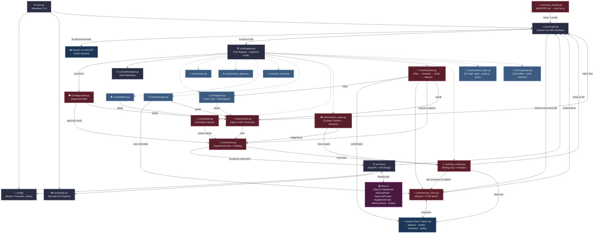

# 🪐 Freya v3 Architecture

Welcome to the internal blueprint of **Freya v3**, an advanced, real-time AI voice agent engineered with Google's Gemini Live API. This document details the component hierarchy, data flow pathways, and operational design patterns that power Freya's dual-process architecture.

---

## 🛰️ System Topology

Freya is structured as a modular, event-driven architecture designed to minimize latency and ensure smooth audio pipeline execution. The system consists of a **Python backend** (FastAPI + Gemini Live WebSocket + PyAudio) and an optional **Next.js frontend** connected via a local WebSocket bridge.


```mermaid
graph TD
    %% Entry points
    Main["⚙️ main.py<br>(Headless CLI)"]
    Server["⚙️ server.py<br>(FastAPI + WS Bridge)"]
    UI["💻 freya-ui<br>(Next.js Dashboard:<br>MissionPanel · ApprovalPrompt ·<br>SuggestionChips · MemoryPanel · Avatar)"]
    Config["📁 config/<br>(Modes, Personas, Gates)"]

    %% Core engine
    AudioEngine["🔊 core/audio.py<br>(PyAudio I/O Pipeline)"]
    ModelEngine["⚡ core/model.py<br>(Gemini Live WS Interface)"]
    RegDispatcher["🛠️ core/registry.py<br>(Tool Registry + Approval Hook)"]
    SkillLoader["⌬ core/skills/loader.py<br>(Skill Manifests)"]

    %% Platform layer (v4)
    EventBus["📡 core/events.py<br>(Typed Event Bus + Replay)"]
    Approvals["🛡️ core/approvals.py<br>(Approval Gate)"]
    Missions["🎯 core/missions.py<br>(Plan → Execute → Verify → Report)"]
    Avatar["💃 core/avatar.py<br>(Animation Intents)"]
    MemoryStore["🧠 core/memory_store.py<br>(SQLite + FTS5 Items)"]
    ContextWatch["👁️ core/context_watch.py<br>(Context Tracker + attention)"]
    MachineIndex["🔦 core/machine_index.py<br>(PC Map: apps · projects · docs)"]
    Organizer["🧹 core/organizer.py<br>(Tidy folder + undo manifest)"]
    DayContext["📅 core/day_context.py<br>(Rolling Day + Rotation)"]
    Identity["🪪 core/user_identity.py<br>(MEMORY.md → who he is)"]
    Runtime["⚡ core/runtime.py<br>(inject / emit / transcript)"]

    %% Existing superpowers
    Agents["🤖 core/agents.py<br>(react_loop + Sub-agents)"]
    Screen["🎯 core/screen.py"]
    BrowserAgent["🌐 core/browser_agent.py"]
    Ambient["👁️ core/ambient.py"]
    SelfExtend["🧬 core/self_extend.py"]
    Scheduler["⏰ core/scheduler.py"]

    %% External
    GeminiLive["☁️ Gemini Live WS API<br>(voice session)"]
    GeminiText["🧠 Gemini Flash / Flash-Lite<br>(planner · verifier · extraction · drafts)"]

    %% Flows
    Main --> Config
    Main --> AudioEngine
    Main --> ModelEngine
    Server --> Config
    Server --> AudioEngine
    Server --> ModelEngine
    Server <-->|WebSocket| UI
    EventBus -->|broadcast subscriber| Server

    ModelEngine <-->|Bi-directional Audio| GeminiLive
    ModelEngine -->|Function Calls| RegDispatcher
    RegDispatcher -->|sensitive?| Approvals
    RegDispatcher --> SkillLoader
    RegDispatcher -.-> Agents & Screen & BrowserAgent & Ambient & SelfExtend & Scheduler & Avatar & ContextWatch & Missions & DayContext & MachineIndex & Organizer

    Missions -->|steps| Agents
    Missions -->|verify/report| GeminiText
    Missions --> MemoryStore
    Scheduler -->|due reminders| MemoryStore
    ContextWatch -->|focus spans| DayContext
    EventBus -->|outcomes| DayContext
    DayContext -->|day summary at rotation| MemoryStore
    DayContext -->|close-out| GeminiText
    Identity -->|name + profile| ModelEngine
    DayContext -->|today so far| ModelEngine
    MemoryStore -->|ranked block| ModelEngine
    ContextWatch -->|suggestions| EventBus
    Avatar -->|avatar intents| EventBus
    Approvals -->|approval cards| EventBus
    Missions -->|mission progress| EventBus

    Agents & Scheduler & Ambient & Missions & Approvals -->|speak| Runtime
    Runtime -->|Inject Text| ModelEngine
    Runtime -->|emit| EventBus

    ModelEngine -->|session end transcript| MemoryStore
    MemoryStore <-->|extraction| GeminiText

    %% Styling
    classDef primary fill:#2b2d42,stroke:#8d99ae,stroke-width:2px,color:#edf2f4;
    classDef external fill:#1d3557,stroke:#457b9d,stroke-width:2px,color:#f1faee;
    classDef platform fill:#5a1e2b,stroke:#d99ba6,stroke-width:2px,color:#fdeaea;
    classDef superpower fill:#3d5a80,stroke:#98c1d9,stroke-width:2px,color:#e0fbfc;
    classDef frontend fill:#4a1942,stroke:#c77dba,stroke-width:2px,color:#f1faee;

    class Main,Server,Config,AudioEngine,ModelEngine,RegDispatcher,SkillLoader primary;
    class GeminiLive,GeminiText external;
    class EventBus,Approvals,Missions,Avatar,MemoryStore,ContextWatch,DayContext,Identity,Runtime platform;
    class Agents,Screen,BrowserAgent,Ambient,SelfExtend,Scheduler,MachineIndex,Organizer superpower;
    class UI frontend;
```

---

## ⚡ Core Subsystems

### Connection & Event Loop (`core/model.py`)
This is the heart of real-time interaction using the asynchronous `google-genai` SDK:
- **Bi-directional WebSocket Loop**: Persistent connection via `LiveConnectConfig`.
- **Concurrency**: Parallel async tasks manage microphone piping (16kHz), model audio receipt, and speaker piping (24kHz).
- **Tool Routing**: Function calls are dispatched through the specialized **Async Tool Registry** (`core/registry.py`).
- **Proactive Influx**: A `core/runtime.py` text channel enables background agents or ambient screen-watching tasks to inject natural speech into the active live session unprompted.
- **Session Continuity**: The server emits a fresh session-resumption handle throughout a session; a GoAway raises `SessionRotation` so the client leaves voluntarily and reconnects with that handle. If a handle is missing or rejected, `_send_recap()` replays the transcript tail instead.

### Context Budget (`core/model.py:_compression_budget`)
The Live API compresses the context with a sliding window once it passes `trigger_tokens`,
shrinking it back to `target_tokens`. Both are configurable under `freya.*` and both are
**ours, not a Gemini limit** — `gemini-3.1-flash-live-preview` accepts 131,072 input tokens.

| | value | owner |
| :--- | ---: | :--- |
| model input limit | 131,072 | Google |
| `compression_trigger_tokens` | 96,000 | config |
| `compression_target_tokens` | 32,000 | config |
| immovable baseline (system prompt + 108 tool declarations) | ~12,200 | code |
| conversation retained after a compression | ~19,800 | result |

The baseline is re-sent on **every turn**, so it is both a per-turn cost and a permanent
deduction from the target. `_compression_budget()` measures it from the exact declarations
being sent (wire JSON, not the pydantic repr, which overstates by ~28%), prints it at startup,
and shouts if `target <= baseline`:

```
Context budget: baseline ~12,173 tok (prompt 2,763 + 108 tools 9,410)
                trigger 96,000 / target 32,000 -> ~19,827 tok for conversation
```

> The original settings were `trigger=16,000` with `target` unset (the server then assumes
> `trigger/2` = 8,000) — **below the baseline itself**. Compression fired within a turn or two
> and evicted the conversation continuously, which surfaced as Freya explaining a screenshot
> and then, one turn later, not knowing what "question 12" referred to. The startup line exists
> so that class of bug can never be silent again.

### Async Tool Registry (`core/registry.py`)
Freya uses a dynamic registry instead of static dispatched calls:
- Skills self-register tools via `@tool(...)` decorators; the skill loader stamps each tool with its owning skill id for the `/skills` catalog.
- dispatcher handles `async` tools natively and runs synchronous tools in a background executor to guarantee audio thread non-blocking.
- **Two gates, both enforced.** A tool may carry its own `gate="a.b.c"`, and the *skill* that owns it may carry one in its manifest. `build_declarations()` checks both. Only the per-tool gate used to be enforced, so the dashboard's skill toggle silently did nothing for any skill whose tools didn't repeat the gate individually — it wrote the flag, reported "applies on next session start", and the tools came back anyway.
- **Order matters: guard, then approve.** `safety.guard()` runs *before* `needs_approval()`. A hard-refused action must never generate an approval card — asking the user to authorise a write into `C:\Windows` that will then be refused anyway trains him to click yes on prompts that mean nothing.
- **Safety**: The guard (`core/safety.py`) blocks outright-destructive commands and enforces the zone rules and allow-list; `needs_approval()` routes *sensitive* calls through the approval gate (`core/approvals.py`) before execution — including legacy and MCP tools.
- `ToolContext.source` ("live" vs "mission:<id>") decides whether an approval defers the work (voice session never blocks) or genuinely awaits the user's decision (background mission step).

## 🦾 Superpowers Layer (v3.5+)

Specialized skills configured by flags in `config/freya_config.json`:

### 1. Agents & Autonomous Logic (`core/agents.py` & `core/browser_agent.py`)
For heavy multi-step tasks that cannot block the live session:
- **Sub-agents**: Delegated ReAct loops for 'researcher', 'coder', or 'operator' agents running in background.
- **Browser Automation**: `browser_task` autonomous, agentic web driving using direct Chromium control.

### 2. Screen Interaction (`core/screen.py`)
Precision interaction with the Windows GUI:
- Direct operation of UI elements (invoke, type, toggle) by visible name using standard Windows accessibility APIs—**never coordinate guessing.**

### 3. State & Proactive Intelligence (`core/runtime.py` & `core/ambient.py`)
- Background processes (agents, scheduled reminders, ambient triggers) push text to `runtime.inject()`, making Freya speak freely.
- Ambient Screen Intelligence watches the desktop and reacts when specified conditions are met.

---

## 🧭 Agent Platform Layer (v4)

The v4 upgrade turns Freya from a voice assistant into an agent platform. New subsystems:

### Event Bus (`core/events.py`)
Session-independent typed bus behind `runtime.emit()`. `server.py` subscribes its WebSocket
broadcaster once at startup, so mission/approval/suggestion events reach the dashboard even
when no voice session is live. Keeps a replay buffer so reconnecting clients catch up.
New event families (`mission`, `approval`, `avatar`, `suggestion`, `context`, `persona`,
`memory_changed`) use a nested `{type, payload}` wire shape; legacy families stay flat.

### Approval Gate (`core/approvals.py` + `core/safety.py:needs_approval`)
Human-in-the-loop checkpoint enforced inside `registry.dispatch` (before the legacy fallback,
so every tool is covered). Live-session calls return an `APPROVAL_REQUIRED` token with a
deferred thunk (the audio loop never blocks); background mission steps genuinely await an
`asyncio.Future`. Approve/deny by voice (`approve_action`/`reject_action`) or dashboard card —
first resolution wins; timeouts auto-deny.

### Mission Orchestrator (`core/missions.py`)
Plan → execute → verify → report for high-level goals. One JSON-schema Gemini call plans the
steps; each step runs through the shared ReAct executor (`agents.react_loop`) with a curated
agent spec; a cheap verifier model checks each result (one retry with feedback); a final
report is spoken via `runtime.inject`. Publishes `mission` events for the dashboard's
reasoning panel. Sensitive steps pause on the approval gate via `ToolContext(source="mission:<id>")`.

### Structured Memory (`core/memory_store.py` + `core/memory_tools.py`)
SQLite + FTS5 store of typed items (preference / person / project / deadline / followup /
fact / session_summary) replacing the append-only markdown (auto-imported once, backup kept).
`compose_prompt()` renders the ranked system-prompt view; the scheduler speaks due items;
`remember`/`forget`/`list_memories` tools + REST CRUD (`/memory/items`) + dashboard panel.
Items are mirrored into the Chroma vector store so semantic `recall` covers them.

Because that block is re-sent every turn, it is **curated, not exhaustive**: `compose_prompt()`
takes only the top `memory.prompt_max_items` (default 20) and excludes bulk `markdown_import`
rows, which are history rather than standing facts. Nothing is hidden — `recall`,
`list_memories` and the vector store still reach every row. `dedupe()` and
`purge_trivial_day_summaries()` run once per process from `load_memory()`, soft-deleting
(`active = 0`, the same mechanism as `forget`) repeated contents and empty day close-outs.

### Session Recall (`core/runtime.py` + `recall_conversation`)
`FreyaModel.run()` publishes the live `TranscriptCollector` through `runtime.set_transcript()`
alongside the inject/emit channels. Server-side compression is invisible to the client — it
never announces what it dropped — so this transcript is the one copy of the conversation we
control. `recall_conversation` searches it, letting her look up a stale reference silently
instead of asking him to repeat himself.

### Identity (`core/user_identity.py`)
`memory/MEMORY.md` is the **only** source of the user's name and profile — not the config, not
the Windows account folder, not session extraction (whose prompt is explicitly told never to
store it). `get_user_name()` / `get_preferred_name()` parse it (mtime-cached), and
`memory.py:_identity_block()` injects the profile plus the instruction to actually *use* his
first name. With no MEMORY.md she uses no name at all rather than inventing one.

### Day Context (`core/day_context.py`)
The middle ground between a session that forgets everything and a store of durable facts:
what *today* has been about. Three tables in the memory DB (`days`, `day_events`,
`day_activity`) hold a logical day — `context.day.day_start_hour`, default 04:00, so a 1am
session still belongs to yesterday.

It fills from three feeds without any new polling: finished focus spans from the context
tracker (per-app time totals, plus a timeline line past 8 minutes), user utterances sampled
every 3 minutes, and one event-bus subscriber picking up mission outcomes, fired reminders,
approval decisions and finished sub-agents.

At the boundary `DayRotator` **rotates**: the open day is summarized (one flash-lite call
returning summary + unfinished threads + highlights, deterministic fallback if unavailable),
closed, and its unfinished threads become the next day's carry-over. Every stale day is closed
in order, so a weekend off yields three summaries rather than one blur. Only model-written
summaries are archived to long-term memory — fallback close-outs are bookkeeping, not memory.
`compose_prompt()` renders today plus the previous day into the system prompt; since the
personality is rebuilt on every reconnect, a rollover mid-run is picked up automatically.
Tools: `note_day_context`, `get_day_context`, `rotate_day_context`.

### Attention Routing (`core/context_watch.py:attention` → `core/web.py:_surfaces`)
`show_info` / `show_image` pick their surface from where he is actually looking rather than
from the model's guess. `attention()` reads the foreground window directly (independent of the
tracker loop, which is off by default) and caches for 2s; the dashboard is recognised by its
window title (`desktop_popup.dashboard_title_match`, default matching `F.R.E.Y.A`).

| foreground window | dashboard card | desktop toast |
| :--- | :---: | :---: |
| Freya's own dashboard | ✔ | ✖ (a toast over her own UI is noise) |
| anything else — editor, PDF, video, game | ✔ | ✔ |
| Win32 metadata unavailable | ✔ | ✔ (unknown must behave like "not looking") |

An explicit `where` is always obeyed. The tool result tells her which surface it landed on, so
her spoken line can match. The point: when he is studying or watching something, a card on the
dashboard is displayed to nobody, and he ends up asking her to repeat what she already "showed".

### Context Tracker (`core/context_watch.py`)
Opt-in, metadata-only awareness: polls foreground window title/process/idle time via pywin32
(no screenshots). Heuristics (`stuck`, `idle_return`, `form_like`) fire rate-limited
`suggestion` events with per-kind backoff on dismissal, quiet hours, and a global hourly cap.
Vision only escalates when a suggestion is accepted.

### Avatar Intents (`core/avatar.py` → `freya-ui/app/components/avatar/`)
The LLM animates Freya's 3D body through tools (`set_expression`, `set_gesture`,
`set_idle_state`, `trigger_thinking`, …) that publish `avatar` events. The frontend
`AvatarController` runs three layers: a never-empty looping base clip per state, one-shot
gesture blends, and procedural breathing/look-at/tilt applied every frame. A model manifest
maps intents → clip names per GLB (`Freya.glb` fallback + Blender-authored `FreyaV2.glb`
with contract-named clips). Base states follow session state with zero LLM calls.

### Machine Awareness (`core/machine_index.py`, `core/system_tools.py`, `core/context_watch.py`)
The design goal is that Freya never asks *"where is it installed?"* or *"what are you doing?"* —
both are questions she can answer herself, and asking makes her feel like a chatbot with a
keyboard rather than something living on the machine.

**Where things are.** `machine_index.py` keeps a SQLite map of the PC (`memory/machine_index.db`,
one `entries` table: kind/name/path/detail). Four scanners populate it — Start Menu `.lnk`s, the
uninstall registry, `Get-StartApps` for Microsoft Store/UWP apps, and a budgeted `os.walk` of the
user folders and data drives. `lookup()` is token-based, not substring: "vs code" has to find
"Visual Studio Code", and `LIKE '%vs code%'` never will. Its 4,000-row candidate cap carries an
explicit `ORDER BY` on kind, because the table is ~87% indexed media and an unordered `LIMIT`
filled every slot with photographs before scoring ran.

**Launching.** `open_app` resolves in order: config override (only if the path still exists —
these entries rot), then the index, then a time-boxed live disk walk. Three shapes of path are
handled: a file (`os.startfile`, which resolves `.lnk` and file associations), a
`shell:AppsFolder\<AppID>` app-id for Store apps (`explorer.exe`), and a *directory* — the
uninstall registry stores `InstallLocation`, so 58 indexed apps pointed at a folder and used to
open Explorer instead of the program. `_exe_in()` picks the real executable out of it.

> The declaration is the feature. `open_app` was first fixed as a handler-only override that
> kept `model.py`'s static declaration — so the handler could reach 285 apps while the
> declaration still advertised `"valorant, photoshop, discord, steam, word, edge, vscode"`, the
> config keys. The model never tried anything else. Tool descriptions are the *only* place the
> live model learns what it can do; a correct implementation behind a stale contract is invisible.

**What's open.** `list_windows` enumerates via `EnumWindows` + `GetWindowThreadProcessId` +
psutil, so it reports the owning *program* and marks the foreground one, grouped by process;
`include_background` adds a filtered `process_iter` pass. `get_active_window` wraps the same
`attention()` used for card routing. Both read on demand — the context tracker stays off, so
this is answering when asked, not surveillance.

**Tidying.** `core/organizer.py` sorts a folder into type buckets in a single call rather than
one `move_item` round-trip per file. It skips shortcuts, hidden files and anything `zone_of()`
calls protected, and writes an undo manifest (`memory/organize_undo.json`) — it runs without an
approval prompt, so reversibility *is* the safety mechanism.

### Personas & Skills (`config/__init__.py`, `core/skills/loader.py`)
Modes now carry `voice_override`, `speech_style`, `theme` (accent/glow/core params) and
`avatar_idle`; the server publishes `persona` events that recolor the UI and repose the
avatar. Every capability module is a skill with a manifest; the loader stamps each tool
with its owning skill for the `/skills` catalog and per-skill gate toggles.

---

## 🔒 What Never Leaves the Machine

Freya's usefulness comes from remembering things, and everything she remembers is personal.
The repository is therefore structured so that **the code is shareable and the state is not**.

| Path | Contains | Tracked? |
| :--- | :--- | :---: |
| `config/freya_config.example.json` | Template: settings, no paths | ✔ |
| `config/freya_config.json` | Absolute paths to what's installed here | ✖ |
| `memory/MEMORY.md` | Your name and profile | ✖ |
| `memory/freya_memory.db` | Typed memories, session summaries, day log | ✖ |
| `memory/rag_db/` | Vector embeddings of the above | ✖ |
| `memory/machine_index.db` | Paths to every app, project and document | ✖ |
| `memory/browser_profile/` | Chromium cookies, logins, history | ✖ |
| `core/skills/custom/*.py` | Tools Freya wrote for herself at runtime | ✖ |

`config/__init__.py:ensure_config()` copies the example to `freya_config.json` on first run, so
a fresh clone is configured without shipping anyone's machine layout. Everything else is rebuilt
by first use. API keys live in `.env` and are read via `os.getenv` — never in config, never in
committed files.

> This is an architectural constraint, not housekeeping. An assistant with long-term memory
> turns a repo into a diary the moment its state directory is tracked, and the failure is silent:
> the code looks fine, and the leak is in files nobody reads during review.

---

## 🧪 Test Surface

Offline, no mic, no quota, no network — `test_scripts/`:

| Suite | Proves |
| :--- | :--- |
| `test_smoke.py` | Config loads from the template; all 23 skills import; every declared tool has a handler; no duplicate declarations; harmless tools need no approval while `delete_item`/`shutdown_computer` still do; the guard refuses writes into Windows and moves of a git repo |
| `test_awareness.py` | `open_app` is declared exactly once and no longer advertises only config keys; window enumeration reports processes and marks focus |
| `test_search.py` | Token-based index ranking; `live_search` matches multi-word queries; `search_files` honours its time budget |
| `test_organizer.py` | Tidy → undo restores the folder byte-for-byte; shortcuts, dotfiles and nested repos untouched; re-running is a no-op |

---

## 🛰️ REST and WebSocket Surface

| Surface | Description |
| :--- | :--- |
| **REST API** | Model/voice config, structured memory CRUD (`/memory/items`), skill catalog (`/skills`), session lifecycle (`/start`, `/stop`), dev event injection (`/debug/emit`). |
| **WebSocket** | Real-time pushes for `transcript`/`speech` streaming, `tool` results, `state` changes, `mission` progress, `approval` requests, `avatar` intents, `suggestion` chips, `context` line, `day` rotations, and `persona` themes. Client→server: `approval_response`, `mission_command`, `suggestion_response`, plus session/config controls. |
