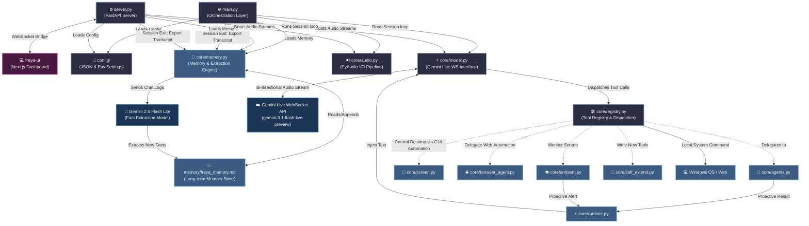

# 🪐 Freya v3 Architecture

Welcome to the internal blueprint of **Freya v3**, an advanced, real-time AI voice agent engineered with Google's Gemini Live API. This document details the component hierarchy, data flow pathways, and operational design patterns that power Freya's dual-process architecture.

---

## 🛰️ System Topology

Freya is structured as a modular, event-driven architecture designed to minimize latency and ensure smooth audio pipeline execution. The system consists of a **Python backend** (FastAPI + Gemini Live WebSocket + PyAudio) and an optional **Next.js frontend** connected via a local WebSocket bridge.

```mermaid
graph TD
    %% Nodes
    Main["⚙️ main.py<br>(Orchestration Layer)"]
    Server["⚙️ server.py<br>(FastAPI Server)"]
    UI["💻 freya-ui<br>(Next.js Dashboard)"]
    Config["📁 config/<br>(JSON & Env Settings)"]
    MemoryFile["📝 memory/freya_memory.md<br>(Long-term Memory Store)"]
    MemoryEngine["🧠 core/memory.py<br>(Memory & Extraction Engine)"]
    AudioEngine["🔊 core/audio.py<br>(PyAudio I/O Pipeline)"]
    ModelEngine["⚡ core/model.py<br>(Gemini Live WS Interface)"]
    RegDispatcher["🛠️ core/registry.py<br>(Tool Registry & Dispatcher)"]

    %% External Interfaces
    GeminiLive["☁️ Gemini Live WebSocket API<br>(gemini-3.1-flash-live-preview)"]
    GeminiFlash["🧠 Gemini 2.5 Flash Lite<br>(Fact Extraction Model)"]

    %% Superpower Modules
    Agents["🤖 core/agents.py"]
    Screen["🎯 core/screen.py"]
    BrowserAgent["🌐 core/browser_agent.py"]
    Ambient["👁️ core/ambient.py"]
    SelfExtend["🧬 core/self_extend.py"]

    %% Flows
    Main -->|Loads Config| Config
    Main -->|Loads Memory| MemoryEngine
    MemoryEngine <-->|Reads/Appends| MemoryFile
    Main -->|Boots Audio Streams| AudioEngine
    Main -->|Runs Session loop| ModelEngine

    Server -->|Loads Config| Config
    Server -->|Loads Memory| MemoryEngine
    Server <-->|WebSocket Bridge| UI
    Server -->|Boots Audio Streams| AudioEngine
    Server -->|Runs Session loop| ModelEngine

    ModelEngine <-->|Bi-directional Audio Stream| GeminiLive
    ModelEngine -->|Dispatches Tool Calls| RegDispatcher

    %% Tool Routing
    RegDispatcher -.->|Delegates to| Agents
    RegDispatcher -.->|Control Desktop via GUI Automation| Screen
    RegDispatcher -.->|Delegate Web Automation| BrowserAgent
    RegDispatcher -.->|Monitor Screen| Ambient
    RegDispatcher -.->|Write New Tools| SelfExtend
    RegDispatcher -->|Local System Command| OS["💻 Windows OS / Web"]

    %% Proactive Speech Loop
    Agents -->|Proactive Result| Runtime["⚡ core/runtime.py"]
    Ambient -->|Proactive Alert| Runtime
    Runtime -->|Inject Text| ModelEngine

    Main -->|Session Exit: Export Transcript| MemoryEngine
    Server -->|Session Exit: Export Transcript| MemoryEngine
    MemoryEngine -->|Sends Chat Logs| GeminiFlash
    GeminiFlash -->|Extracts New Facts| MemoryFile

    %% Styling
    classDef primary fill:#2b2d42,stroke:#8d99ae,stroke-width:2px,color:#edf2f4;
    classDef external fill:#1d3557,stroke:#457b9d,stroke-width:2px,color:#f1faee;
    classDef superpower fill:#3d5a80,stroke:#98c1d9,stroke-width:2px,color:#e0fbfc;
    classDef frontend fill:#4a1942,stroke:#c77dba,stroke-width:2px,color:#f1faee;

    class Main,Server,Config,AudioEngine,ModelEngine,RegDispatcher primary;
    class GeminiLive,GeminiFlash external;
    class Agents,Screen,BrowserAgent,MemoryFile,MemoryEngine,OS,Runtime,Ambient,SelfExtend superpower;
    class UI frontend;
```

---

## ⚡ Core Subsystems

### Connection & Event Loop (`core/model.py`)
This is the heart of real-time interaction using the asynchronous `google-genai` SDK:
- **Bi-directional WebSocket Loop**: Persistent connection via `LiveConnectConfig`.
- **Concurrency**: Parallel async tasks manage microphone piping (16kHz), model audio receipt, and speaker piping (24kHz).
- **Tool Routing**: Function calls are dispatched through the specialized **Async Tool Registry** (`core/registry.py`).
- **Proactive Influx**: A `core/runtime.py` text channel enables background agents or ambient screen-watching tasks to inject natural speech into the active live session unprompted.

### Async Tool Registry (`core/registry.py`)
Freya uses a dynamic registry instead of static dispatched calls:
- Skills self-register tools via `@tool(...)` decorators.
- dispatcher handles `async` tools natively and runs synchronous tools in a background executor to guarantee audio thread non-blocking.
- **Safety**: A safety guard (`core/safety.py`) filters all dangerous commands.

## 🦾 Superpowers Layer (v3.5+)

Specialized skills configured by flags in `config/freya_config.json`:

### 1. Agents & Autonomous Logic (`core/agents.py` & `core/browser_agent.py`)
For heavy multi-step tasks that cannot block the live session:
- **Sub-agents**: Delegated ReAct loops for 'researcher', 'coder', or 'operator' agents running in background.
- **Browser Automation**: `browser_task` autonomous, agentic web driving using direct Chromium control.

### 2. Screen Interaction (`core/screen.py`)
Precision interaction with the Windows GUI:
- Direct operation of UI elements (invoke, type, toggle) by visible name using standard Windows accessibility APIs—**never coordinate guessing.**

### 3. State & Proactive Intelligence (`core/runtime.py` & `core/ambient.py`)
- Background processes (agents, scheduled reminders, ambient triggers) push text to `runtime.inject()`, making Freya speak freely.
- Ambient Screen Intelligence watches the desktop and reacts when specified conditions are met.

---

## 🛰️ REST and WebSocket Surface

| Surface | Description |
| :--- | :--- |
| **REST API** | Model/voice config, memory CRUD, and session lifecycle control (`/start`, `/stop`). |
| **WebSocket** | Real-time pushes for `transcript` streaming, `tool` results, `state` changes, and agent status events. |
