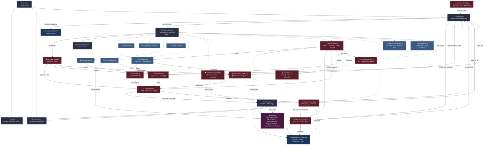

# 🪐 Freya v3 Architecture

Welcome to the internal blueprint of **Freya v3**, an advanced, real-time AI voice agent engineered with Google's Gemini Live API. This document details the component hierarchy, data flow pathways, and operational design patterns that power Freya's dual-process architecture.

---

## 🛰️ System Topology

Freya is structured as a modular, event-driven architecture designed to minimize latency and ensure smooth audio pipeline execution. The system consists of a **Python backend** (FastAPI + Gemini Live WebSocket + PyAudio) and an optional **Next.js frontend** connected via a local WebSocket bridge.


```mermaid
graph TD
    %% Entry points
    Main["⚙️ main.py<br>(Headless CLI)"]
    Server["⚙️ server.py<br>(FastAPI + WS Bridge)"]
    UI["💻 freya-ui<br>(Next.js Dashboard:<br>MissionPanel · ApprovalPrompt ·<br>SuggestionChips · MemoryPanel · Avatar)"]
    Config["📁 config/<br>(Modes, Personas, Gates)"]

    %% Core engine
    AudioEngine["🔊 core/audio.py<br>(PyAudio I/O Pipeline)"]
    ModelEngine["⚡ core/model.py<br>(Gemini Live WS Interface)"]
    RegDispatcher["🛠️ core/registry.py<br>(Tool Registry + Approval Hook)"]
    SkillLoader["⌬ core/skills/loader.py<br>(Skill Manifests)"]

    %% Platform layer (v4)
    EventBus["📡 core/events.py<br>(Typed Event Bus + Replay)"]
    Approvals["🛡️ core/approvals.py<br>(Approval Gate)"]
    Missions["🎯 core/missions.py<br>(Plan → Execute → Verify → Report)"]
    Avatar["💃 core/avatar.py<br>(Animation Intents)"]
    MemoryStore["🧠 core/memory_store.py<br>(SQLite + FTS5 Items)"]
    ContextWatch["👁️ core/context_watch.py<br>(Context Tracker + attention)"]
    MachineIndex["🔦 core/machine_index.py<br>(PC Map: apps · projects · docs)"]
    Organizer["🧹 core/organizer.py<br>(Tidy folder + undo manifest)"]
    DayContext["📅 core/day_context.py<br>(Rolling Day + Rotation)"]
    Identity["🪪 core/user_identity.py<br>(MEMORY.md → who he is)"]
    Runtime["⚡ core/runtime.py<br>(inject / emit / transcript)"]
    Activity["🟢 core/activity_overlay.py<br>(What she is doing now)"]
    Jev["⚡ core/systemone.py<br>(Jev · optional, key-gated)"]
    Quota["⏱️ core/quota.py<br>(pacing · retries · flash→lite)"]

    %% Existing superpowers
    Agents["🤖 core/agents.py<br>(react_loop + Sub-agents)"]
    Screen["🎯 core/screen.py"]
    BrowserAgent["🌐 core/browser_agent.py"]
    Ambient["👁️ core/ambient.py"]
    SelfExtend["🧬 core/self_extend.py"]
    Scheduler["⏰ core/scheduler.py"]

    %% External
    GeminiLive["☁️ Gemini Live WS API<br>(voice session)"]
    GeminiText["🧠 Gemini Flash / Flash-Lite<br>(planner · verifier · extraction · drafts)"]

    %% Flows
    Main --> Config
    Main --> AudioEngine
    Main --> ModelEngine
    Server --> Config
    Server --> AudioEngine
    Server --> ModelEngine
    Server <-->|WebSocket| UI
    EventBus -->|broadcast subscriber| Server

    ModelEngine <-->|Bi-directional Audio| GeminiLive
    ModelEngine -->|Function Calls| RegDispatcher
    RegDispatcher -->|sensitive?| Approvals
    RegDispatcher --> SkillLoader
    RegDispatcher -.-> Agents & Screen & BrowserAgent & Ambient & SelfExtend & Scheduler & Avatar & ContextWatch & Missions & DayContext & MachineIndex & Organizer

    Missions -->|steps| Agents
    Missions -->|verify/report| GeminiText
    Missions --> MemoryStore
    Scheduler -->|due reminders| MemoryStore
    ContextWatch -->|focus spans| DayContext
    EventBus -->|outcomes| DayContext
    DayContext -->|day summary at rotation| MemoryStore
    DayContext -->|close-out| GeminiText
    Identity -->|name + profile| ModelEngine
    DayContext -->|today so far| ModelEngine
    MemoryStore -->|ranked block| ModelEngine
    ContextWatch -->|suggestions| EventBus
    Avatar -->|avatar intents| EventBus
    Approvals -->|approval cards| EventBus
    Missions -->|mission progress| EventBus

    Agents & Scheduler & Ambient & Missions & Approvals -->|speak| Runtime
    Runtime -->|Inject Text| ModelEngine
    Runtime -->|emit| EventBus

    ModelEngine -->|session end transcript| MemoryStore
    ModelEngine -->|tool start/finish · state| Activity
    Approvals -->|approval waits| Activity
    RegDispatcher -.->|tool routing| Jev
    Missions -.->|step verify| Jev
    Missions & Agents -->|generate| Quota
    Quota --> GeminiText
    MemoryStore <-->|extraction| GeminiText

    %% Styling
    classDef primary fill:#2b2d42,stroke:#8d99ae,stroke-width:2px,color:#edf2f4;
    classDef external fill:#1d3557,stroke:#457b9d,stroke-width:2px,color:#f1faee;
    classDef platform fill:#5a1e2b,stroke:#d99ba6,stroke-width:2px,color:#fdeaea;
    classDef superpower fill:#3d5a80,stroke:#98c1d9,stroke-width:2px,color:#e0fbfc;
    classDef frontend fill:#4a1942,stroke:#c77dba,stroke-width:2px,color:#f1faee;

    class Main,Server,Config,AudioEngine,ModelEngine,RegDispatcher,SkillLoader primary;
    class GeminiLive,GeminiText external;
    class EventBus,Approvals,Missions,Avatar,MemoryStore,ContextWatch,DayContext,Identity,Runtime,Activity,Jev,Quota platform;
    class Agents,Screen,BrowserAgent,Ambient,SelfExtend,Scheduler,MachineIndex,Organizer superpower;
    class UI frontend;
```

---

## ⚡ Core Subsystems

### Connection & Event Loop (`core/model.py`)
This is the heart of real-time interaction using the asynchronous `google-genai` SDK:
- **Bi-directional WebSocket Loop**: Persistent connection via `LiveConnectConfig`.
- **Concurrency**: Parallel async tasks manage microphone piping (16kHz), model audio receipt, and speaker piping (24kHz).
- **Tool Routing**: Function calls are dispatched through the specialized **Async Tool Registry** (`core/registry.py`).
- **Proactive Influx**: A `core/runtime.py` text channel enables background agents or ambient screen-watching tasks to inject natural speech into the active live session unprompted.
- **Session Continuity**: The server emits a fresh session-resumption handle throughout a session; a GoAway raises `SessionRotation` so the client leaves voluntarily and reconnects with that handle. If a handle is missing or rejected, `_send_recap()` replays the transcript tail instead.
- **Model fallback** (`core/live_protocol.py:LiveRoute`): quota/unavailable errors move to the next model in the route (3.8 Extended Thinking → 3.8 Live → 3.1 Flash Live). A server-side `1011 Internal error` is retried once on the same model and falls back on the second in a row — it used to burn all five reconnect attempts on a model that was down.

### Recovery Protocol (`core/resilience.py`)
One rule for every layer: **a failure is contained, degraded around, retried, and reported — never terminal while the user wants her running.**

| Step | What happens | Where |
| :--- | :--- | :--- |
| 1. Contain | `guard()` / `aguard()` run a step, log the traceback, return a fallback. Cancellation is never swallowed. | session setup + cleanup, config reloads |
| 2. Degrade | Saved audio device fails → Windows default. Memory/prompt build fails → prompt without memory → last good prompt → base personality. A tool failing 3× in a row rests for 90 s (`ToolBreaker`); calls meanwhile are answered at once with "use another route". | `server._open_audio`, `server._build_personality`, `model.settle` |
| 3. Retry forever | Live reconnects use capped, jittered backoff (2 s → 60 s) with **no attempt limit**; a session that ran > 60 s resets the streak. A clean server-side close is treated as a disconnect. A refused key waits for a new key and reconnects by itself. `supervise_freya()` restarts a session that crashed outside its own loop (e.g. no audio device yet). | `server.run_freya`, `server.supervise_freya` |
| 4. Report | `health` holds per-component state (`live`, `mic`, `speaker`, `memory`, `tools`: ok / degraded / recovering / down), published as a `health` event, sent to every new dashboard, and served at `GET /health`. The header shows it. | `core/resilience.health` |

Every tool call is bounded by `live.tool_timeout_s` (default 300 s): a hung tool used to hold the one-job executor forever.

On the dashboard: each card sits in its own self-healing `ErrorBoundary autoRetry` (backoff 2 s → 60 s), both canvases rebuild after a lost WebGL context (`useWebGLRecovery`), a frame that fails to apply is skipped rather than thrown, and messages sent while the socket is reconnecting are queued and delivered on reconnect.

### Tool Scheduling: talk first, one job at a time (`core/model.py:execute_tools`)
A single executor runs tools in order, so desktop actions never overlap. On top of that:

- **Background after 2 s.** A tool still running after `SLOW_TOOL_SECONDS` is answered *"still running — tell him what you're doing, keep chatting, don't start anything else"*, so the voice never goes mute during long work. Only `switch_mode`, the screen-capture pair and `search_tools` stay foreground.
- **Queued, not blocked.** While a job is in flight (`busy`), a new work call is answered immediately with *"Queued: this starts automatically as soon as X finishes"* and runs when X is done; its result arrives through the same channel as a background result. Instant, read-only calls (`INSTANT_TOOLS`: avatar body language, `check_agents`, `mission_status`, `list_pending_actions`) run at once and never wait behind work.
- **"Carry on", delivered in order.** A finished job's result is sent as *"Task finished (…). Carry on with what the user asked…"* — not *"report the outcome"*, which ended find-then-open chains after the find. Delivery waits for her to stop speaking and him to pause, behind a FIFO lock so results land in the order the jobs finished. It deliberately does **not** use `runtime.inject`, which waits for zero pending tools and drops the line after 20 s — with a queued job running, the earlier result was silently lost.
- **Talk first** is policy, not plumbing: `task_policy.WORK_RHYTHM` (voice model only; sub-agents don't speak) tells her to say one short sentence before starting any work and never to narrate only afterwards.

### Stall Recovery (`core/model.py:run`)
Gemini 3.8 Live has proactive audio permanently enabled — it may *choose* not to respond — and
occasionally closes a turn after a tool result without the next call. Each case is caught and logged:

| Symptom | Detector | Response |
| :--- | :--- | :--- |
| Turn completes with no audio, words or call after he spoke / after a tool result | `turn["output"]` flag at `turn_complete` | One nudge 1.5 s later quoting what he said (`[live] empty model turn`) |
| Tool result, then nothing for 8 s (24 s in Extended Thinking) | `watch_for_stall` vs `activity` timestamps | One nudge (`live.stall_nudge_s`), skipped if the empty-turn nudge already fired |
| Call syntax spoken aloud (`,name:open_path}`) | `_SPOKEN_ANY_CALL` against real tool names | Scrubbed from the transcript; she's told to make the call — once until a real call or new user speech |
| Mic paused, then silent after resume | — | `audio_stream_end` is sent on pause, as the Live API requires for gaps over ~1 s |

Every nudge is bounded to one per silence, so none of them can loop.

**Console output is UTF-8** (`server.py`/`main.py` reconfigure stdout/stderr with `errors="replace"`). The tool log prints sit inside the executor's `try`; under a piped cp1252 console an emoji or Sinhala string in a result raised there, and a tool that had *succeeded* was reported to the model as failed.

### Context Budget (`core/model.py:_compression_budget`)
The Live API compresses the context with a sliding window once it passes `trigger_tokens`,
shrinking it back to `target_tokens`. Both are configurable under `freya.*` and both are
**ours, not a Gemini limit** — `gemini-3.1-flash-live-preview` accepts 131,072 input tokens.

| | value | owner |
| :--- | ---: | :--- |
| model input limit | 131,072 | Google |
| `compression_trigger_tokens` | 96,000 | config |
| `compression_target_tokens` | 32,000 | config |
| immovable baseline (system prompt + 27 core tool declarations) | ~6,250 | code |
| conversation retained after a compression | ~25,700 | result |

The baseline is re-sent on **every turn**, so it is both a per-turn cost and a permanent
deduction from the target. `core/tool_index.py` keeps it small: only a core set of tools is
declared in full; the rest (~96) are listed by name and reached through `search_tools` →
`run_tool`, which goes through the same `registry.dispatch` (gates, sandbox, approvals).
`_compression_budget()` measures the baseline from the exact declarations being sent (wire
JSON, not the pydantic repr, which overstates by ~28%), prints it at startup, and shouts if
`target <= baseline`:

```
Context budget: baseline ~6,257 tok (prompt 3,603 + 27 tools 2,654)
                trigger 96,000 / target 32,000 -> ~25,743 tok for conversation
```

> The original settings were `trigger=16,000` with `target` unset (the server then assumes
> `trigger/2` = 8,000) — **below the baseline itself**. Compression fired within a turn or two
> and evicted the conversation continuously, which surfaced as Freya explaining a screenshot
> and then, one turn later, not knowing what "question 12" referred to. The startup line exists
> so that class of bug can never be silent again.

### Async Tool Registry (`core/registry.py`)
Freya uses a dynamic registry instead of static dispatched calls:
- Skills self-register tools via `@tool(...)` decorators; the skill loader stamps each tool with its owning skill id for the `/skills` catalog.
- dispatcher handles `async` tools natively and runs synchronous tools in a background executor to guarantee audio thread non-blocking.
- **Two gates, both enforced.** A tool may carry its own `gate="a.b.c"`, and the *skill* that owns it may carry one in its manifest. `build_declarations()` checks both. Only the per-tool gate used to be enforced, so the dashboard's skill toggle silently did nothing for any skill whose tools didn't repeat the gate individually — it wrote the flag, reported "applies on next session start", and the tools came back anyway.
- **Order matters: guard, then approve.** `safety.guard()` runs *before* `needs_approval()`. A hard-refused action must never generate an approval card — asking the user to authorise a write into `C:\Windows` that will then be refused anyway trains him to click yes on prompts that mean nothing.
- **Safety**: The guard (`core/safety.py`) blocks outright-destructive commands and enforces the zone rules and allow-list; `needs_approval()` routes *sensitive* calls through the approval gate (`core/approvals.py`) before execution — including legacy and MCP tools.
- `ToolContext.source` ("live" vs "mission:<id>") decides whether an approval defers the work (voice session never blocks) or genuinely awaits the user's decision (background mission step).
- **Near-miss path hints.** When a tool reports that a path does not exist but its folder does, `_path_hint()` appends the closest real names from that folder (`site-plan-v2.png` → `site-plan v2.png`). One wrapper around `_execute` covers every tool; a bare "not found" used to leave her stalled.
- **`run_tool` normalises arguments**: object keys that arrive still JSON-quoted (`{'"path"': …}`) are unquoted before the required-argument check.

### Process Execution (`core/proc.py`)
`subprocess.run(..., timeout=N)` kills only the direct child when time runs out and then waits
for its pipes — which the rest of an `a | b` pipeline (or any helper the child spawned) still
holds, so it never returns. In the live loop that wedged the tool executor and every call
queued behind it. `proc.run()` kills the whole tree (`taskkill /T`) before re-raising
`TimeoutExpired`; the terminal tool, `run_code`, skill scripts and career scripts all use it.

## 🦾 Superpowers Layer (v3.5+)

Specialized skills configured by flags in `config/freya_config.json`:

### 1. Agents & Autonomous Logic (`core/agents.py` & `core/browser_agent.py`)
For heavy multi-step tasks that cannot block the live session:
- **Sub-agents**: Delegated ReAct loops for 'researcher', 'coder', or 'operator' agents running in background.
- **Browser Automation**: `browser_task` autonomous, agentic web driving using direct Chromium control.
- **Model calls go through `core/quota.py:generate`**: per-model RPM pacing, bounded retries, and a classifier that tells daily quota, per-minute limits and transient 5xx apart. When retries run out on a model with a fallback (`quota.fallback_models`, default `gemini-3.5-flash → gemini-3.5-flash-lite`), the request is retried **once** on the fallback — an overloaded flash (37 s to answer "ok" while flash-lite took 1.5 s) used to fail whole missions and agents. The fallback call is marked so it can never fall back again.

### 2. Screen Interaction (`core/screen.py`)
Precision interaction with the Windows GUI:
- Direct operation of UI elements (invoke, type, toggle) by visible name using standard Windows accessibility APIs—**never coordinate guessing.**

### 3. State & Proactive Intelligence (`core/runtime.py` & `core/ambient.py`)
- Background processes (agents, scheduled reminders, ambient triggers) push text to `runtime.inject()`, making Freya speak freely.
- Ambient Screen Intelligence watches the desktop and reacts when specified conditions are met.

---

## 🧭 Agent Platform Layer (v4)

The v4 upgrade turns Freya from a voice assistant into an agent platform. New subsystems:

### Event Bus (`core/events.py`)
Session-independent typed bus behind `runtime.emit()`. `server.py` subscribes its WebSocket
broadcaster once at startup, so mission/approval/suggestion events reach the dashboard even
when no voice session is live. Keeps a replay buffer so reconnecting clients catch up.
New event families (`mission`, `approval`, `avatar`, `suggestion`, `context`, `persona`,
`memory_changed`) use a nested `{type, payload}` wire shape; legacy families stay flat.

### Approval Gate (`core/approvals.py` + `core/safety.py:needs_approval`)
Human-in-the-loop checkpoint enforced inside `registry.dispatch` (before the legacy fallback,
so every tool is covered). Live-session calls return an `APPROVAL_REQUIRED` token with a
deferred thunk (the audio loop never blocks); background mission steps genuinely await an
`asyncio.Future`. Approve/deny by voice (`approve_action`/`reject_action`) or dashboard card —
first resolution wins; timeouts auto-deny.

### Mission Orchestrator (`core/missions.py`)
Plan → execute → verify → report for high-level goals. One JSON-schema Gemini call plans the
steps; each step runs through the shared ReAct executor (`agents.react_loop`) with a curated
agent spec; a cheap verifier model checks each result (one retry with feedback); a final
report is spoken via `runtime.inject`. Publishes `mission` events for the dashboard's
reasoning panel. Sensitive steps pause on the approval gate via `ToolContext(source="mission:<id>")`.

### Structured Memory (`core/memory_store.py` + `core/memory_tools.py`)
SQLite + FTS5 store of typed items (preference / person / project / deadline / followup /
fact / session_summary) replacing the append-only markdown (auto-imported once, backup kept).
`compose_prompt()` renders the ranked system-prompt view; the scheduler speaks due items;
`remember`/`forget`/`list_memories` tools + REST CRUD (`/memory/items`) + dashboard panel.
Items are mirrored into the Chroma vector store so semantic `recall` covers them.

Because that block is re-sent every turn, it is **curated, not exhaustive**: `compose_prompt()`
takes only the top `memory.prompt_max_items` (default 20) and excludes bulk `markdown_import`
rows, which are history rather than standing facts. Nothing is hidden — `recall`,
`list_memories` and the vector store still reach every row. `dedupe()` and
`purge_trivial_day_summaries()` run once per process from `load_memory()`, soft-deleting
(`active = 0`, the same mechanism as `forget`) repeated contents and empty day close-outs.

Due dates are ISO strings or `NULL`: `_clean_due()` normalises on write and read, and the store
repairs old rows on open. Session extraction used to store `str(None)` — the literal `"None"` —
which the Memory panel showed as *"due None"* and which sorts after every real date. The vector
store drops chunks sourced from files in `memory/` that no longer exist or are `*.example.*`
templates, so `recall` can't answer "what do you know about me" with *"[Your Name]"*.

### Session Recall (`core/runtime.py` + `recall_conversation`)
`FreyaModel.run()` publishes the live `TranscriptCollector` through `runtime.set_transcript()`
alongside the inject/emit channels. Server-side compression is invisible to the client — it
never announces what it dropped — so this transcript is the one copy of the conversation we
control. `recall_conversation` searches it, letting her look up a stale reference silently
instead of asking him to repeat himself.

### Identity (`core/user_identity.py`)
`memory/MEMORY.md` is the **only** source of the user's name and profile — not the config, not
the Windows account folder, not session extraction (whose prompt is explicitly told never to
store it). `get_user_name()` / `get_preferred_name()` parse it (mtime-cached), and
`memory.py:_identity_block()` injects the profile plus the instruction to actually *use* his
first name. With no MEMORY.md she uses no name at all rather than inventing one.

### Day Context (`core/day_context.py`)
The middle ground between a session that forgets everything and a store of durable facts:
what *today* has been about. Three tables in the memory DB (`days`, `day_events`,
`day_activity`) hold a logical day — `context.day.day_start_hour`, default 04:00, so a 1am
session still belongs to yesterday.

It fills from three feeds without any new polling: finished focus spans from the context
tracker (per-app time totals, plus a timeline line past 8 minutes), user utterances sampled
every 3 minutes, and one event-bus subscriber picking up mission outcomes, fired reminders,
approval decisions and finished sub-agents.

At the boundary `DayRotator` **rotates**: the open day is summarized (one flash-lite call
returning summary + unfinished threads + highlights, deterministic fallback if unavailable),
closed, and its unfinished threads become the next day's carry-over. Every stale day is closed
in order, so a weekend off yields three summaries rather than one blur. Only model-written
summaries are archived to long-term memory — fallback close-outs are bookkeeping, not memory.
`compose_prompt()` renders today plus the previous day into the system prompt; since the
personality is rebuilt on every reconnect, a rollover mid-run is picked up automatically.
Tools: `note_day_context`, `get_day_context`, `rotate_day_context`.

### Attention Routing (`core/context_watch.py:attention` → `core/web.py:_surfaces`)
`show_info` / `show_image` pick their surface from where he is actually looking rather than
from the model's guess. `attention()` reads the foreground window directly (independent of the
tracker loop, which is off by default) and caches for 2s; the dashboard is recognised by its
window title (`desktop_popup.dashboard_title_match`, default matching `F.R.E.Y.A`).

| foreground window | dashboard card | desktop toast |
| :--- | :---: | :---: |
| Freya's own dashboard | ✔ | ✖ (a toast over her own UI is noise) |
| anything else — editor, PDF, video, game | ✔ | ✔ |
| Win32 metadata unavailable | ✔ | ✔ (unknown must behave like "not looking") |

An explicit `where` is always obeyed. The tool result tells her which surface it landed on, so
her spoken line can match. The point: when he is studying or watching something, a card on the
dashboard is displayed to nobody, and he ends up asking her to repeat what she already "showed".

### Context Tracker (`core/context_watch.py`)
Opt-in, metadata-only awareness: polls foreground window title/process/idle time via pywin32
(no screenshots). Heuristics (`stuck`, `idle_return`, `form_like`) fire rate-limited
`suggestion` events with per-kind backoff on dismissal, quiet hours, and a global hourly cap.
Vision only escalates when a suggestion is accepted.

### Avatar Intents (`core/avatar.py` → `freya-ui/app/components/avatar/`)
The LLM animates Freya's 3D body through tools (`set_expression`, `set_gesture`,
`set_idle_state`, `trigger_thinking`, …) that publish `avatar` events. The frontend
`AvatarController` runs three layers: a never-empty looping base clip per state, one-shot
gesture blends, and procedural breathing/look-at/tilt applied every frame. A model manifest
maps intents → clip names per GLB (`Freya.glb` fallback + Blender-authored `FreyaV2.glb`
with contract-named clips). Base states follow session state with zero LLM calls.

### Desktop Shader Overlay (`core/shader_overlay.py` + `core/shaders/*.glsl`)
A transparent, click-through, always-on-top layer that renders real GLSL over the live
desktop, so you can see Freya operating the machine. Six effects — element lock-on, click
impact, cursor move, scroll flow, capture scan, typing — each a fragment-shader field in
its own file under `core/shaders/fx/`, sharing noise/SDF helpers from `lib/`.

**Shaders are files, not string literals.** GLSL 330 has no `#include`, so `_shader_sources()`
resolves them host-side and injects `MAX_FX` and `FX_LIFE` as `#define`s — which is what
stops the shader's array bounds drifting from the Python constants (they were previously
hardcoded four separate times). The render thread watches mtimes and recompiles on save,
keeping the last good program if a compile fails.

**Transparency**: rendered offscreen into an FBO with a moderngl standalone context, then
presented via `UpdateLayeredWindow` with a per-pixel-alpha DIB. Color-key and DWM-extend
both fail with OpenGL — they produce an opaque black sheet.

**The present path is the frame budget.** The framebuffer is read back to the CPU every
frame, so the shader emits *premultiplied BGRA in DIB row order* and we `read_into` a
preallocated buffer: one readback, one `memmove`. It previously did a readback plus three
full-frame numpy passes (channel swizzle, vertical flip, a redundant `.copy()`) — roughly
1.1 GB/s at 1080p, which was the real ceiling on shader complexity. Measured cost is now
~6-21 ms/frame at 1920x1080 depending on effect.

> Three effects — click, move, scroll — had **never rendered once**. `POINT` was defined as
> the kind constant `1.0` and then rebound in the same module to a ctypes struct, so
> `float(kind)` raised and a bare `except` swallowed it. The kinds are `K_*` now and the
> struct is `WinPoint`. The lesson is the swallowing handler, not the collision: a failure
> nothing reports is a failure nobody finds.

Colour follows the active persona — `modes.<mode>.theme.accent`, re-read through the same
mtime-cached config pattern as `core/safety.py:_live_safety`, so `switch_mode` re-skins the
overlay with no wiring. The accent is renormalised to full brightness first: UI accents are
picked to sit calmly behind text (`#0f9c6e` peaks at 0.61) and output alpha is derived from
luminance, so feeding one in raw caps every line at 61% opacity.

Coordinates span the **virtual desktop** (`SM_XVIRTUALSCREEN` etc.), so effects land on
secondary monitors; the capture scan still brackets the primary monitor only, because
`capture_screen` grabs `sct.monitors[1]`. Config lives under `overlay` — `enabled`, `fps`,
`intensity`, `palette`, and per-effect toggles.

### Activity Pill (`core/activity_overlay.py`)
A small always-on-top pill at the top-centre of the screen that says what she is doing right
now — *Thinking…*, *Searching your PC for "resume"*, *Opening report.pdf*, *Waiting for your
OK* — with a running timer after 3 s, fading ~1 s after the last activity. 3.8 Live is silent
while a tool runs, so without it a 20-second disk search looked exactly like a hang.

- **Driven by the model loop, not polled**: `tool_started`/`tool_finished` from the executor,
  `heard()` on user transcription (→ *Thinking* once he pauses and nothing has come back),
  `responding()` on any model output, `set_state()` via `FreyaModel._set_state`, and approval
  waits from the event bus. `describe()` turns each tool call (including `run_tool`'s inner
  call) into a plain sentence; body-language tools show nothing.
- **Built not to interfere with the desktop she drives**: click-through
  (`WS_EX_TRANSPARENT`), never activates (`WS_EX_NOACTIVATE`, shown with `SW_SHOWNOACTIVATE`),
  and excluded from capture (`WDA_EXCLUDEFROMCAPTURE`) so `capture_screen` never shows her own
  status. Creating a Tk root grabs the foreground even while withdrawn, so the previous
  foreground window is restored immediately — otherwise the first pill would have pulled focus
  away from the window `press_key` was about to type into.
- Same threading pattern as `desktop_popup.py` (one Tk thread fed by a queue); every public
  call is a no-op when `activity_overlay.enabled` is false. `FREYA_OVERLAY_CAPTURABLE=1`
  keeps it in screenshots for checking the look.

### Activity Feed (`core/activity.py` → header `ActivityIndicator`)
The pill's big sibling on the dashboard. `activity_overlay`'s public calls forward every event here as well, so the two can never disagree. It publishes an `activity` event (also `GET /activity`, and sent to every new dashboard) only when something visible changes:

- **phase** — idle / listening / hearing / thinking / speaking / working / approval / recovering, in that priority (a dropped link beats an approval beats work). "Thinking" is derived on the client from `heardAt`, so no timer runs server-side.
- **tools** — every call in flight with its plain-English label, category and mode (`background` once it outlives the talk-first window).
- **recent / stats** — the tool-usage log: last 12 calls with outcome (`ok`, `error`, `timeout`, `resting`) and duration; session totals. Outcomes come from `model.settle` (exceptions, timeouts, the breaker) and from results that start with "Error"/"Failed".

The header shows the phase as an Elder Futhark rune (ᚲ Kenaz, the torch, for search; ᚠ Fehu for trading; ᚺ Hagalaz for a dropped link…), the sentence, a timer, and a failure mark; clicking opens the log. The desktop pill gained a step counter ("Step 3 · Opening report.pdf"), a red flash when a step fails or times out, and an amber "Reconnecting" line fed from `health`.

### System One / Jev (`core/systemone.py`) — optional
Jev (TypeSafe) answers typed yes/no, pick-one and score questions in ~70–500 ms. It is
early-access, so **the key is the switch**: `TYPESAFE_API_KEY` present → used; absent or blank →
never contacted, and every caller takes the path it had before Jev. `system_one.features.<name>:
false` keeps one feature on Gemini even with a key. The startup log states which.

| Feature | With Jev | Without a key |
| :--- | :--- | :--- |
| `tool_routing` | Semantic pick in `search_tools` | Keyword ranking |
| `mission_verify` | Pass at p ≥ 0.9 before calling the verifier | Gemini verifier |
| `mode_routing` | Auto-switch to Complex Tasks at p ≥ 0.85 | Model's own `switch_mode` |
| `nudge_gate` | Suppresses unwelcome context nudges | Nudges allowed (heuristics + rate limits still apply) |
| `memory_triage` | Skip extraction for chit-chat; per-item importance | Gemini extraction always; its own importance |
| `approval_risk` | Risk label on approval cards | No label; approval still required |

Failures return `None` and open a 60 s circuit breaker, so an outage costs one timeout, not one per turn.

### Trading Lab (`core/trading/`, `freya-ui/app/trading/`)
The page owns the session; she follows it. The page keeps live-market (*observation*)
sessions and reports the one on screen through `POST /trading/workspace`;
`guide._current_view()` picks the most recently focused tab. `open_trading_lab` therefore:
reuses that session when a tab is open (no duplicate tab); otherwise opens `/trading` in **his**
browser and waits for the page to report in; and returns `not_confirmed` — with an instruction
not to claim it is open — if it never does. It used to create a *replay* session and only
return a URL: nothing opened, she said it had, and the page then discarded that session and
made its own, so her later chart tools acted on a session nobody could see.

The chart keeps every candle in view (`autoFit`) until he zooms, pans or picks a range: a single
`fitContent()` on mount could run before the panel had its final width — or any width — which
left the candles bunched against the right edge.

### Machine Awareness (`core/machine_index.py`, `core/system_tools.py`, `core/context_watch.py`)
The design goal is that Freya never asks *"where is it installed?"* or *"what are you doing?"* —
both are questions she can answer herself, and asking makes her feel like a chatbot with a
keyboard rather than something living on the machine.

**Where things are.** `machine_index.py` keeps a SQLite map of the PC (`memory/machine_index.db`,
one `entries` table: kind/name/path/detail). Four scanners populate it — Start Menu `.lnk`s, the
uninstall registry, `Get-StartApps` for Microsoft Store/UWP apps, and a budgeted `os.walk` of the
user folders and data drives. `lookup()` is token-based, not substring: "vs code" has to find
"Visual Studio Code", and `LIKE '%vs code%'` never will. Its 4,000-row candidate cap carries an
explicit `ORDER BY` on kind, because the table is ~87% indexed media and an unordered `LIMIT`
filled every slot with photographs before scoring ran.

**Launching.** `open_app` resolves in order: config override (only if the path still exists —
these entries rot), then the index, then a time-boxed live disk walk. Three shapes of path are
handled: a file (`os.startfile`, which resolves `.lnk` and file associations), a
`shell:AppsFolder\<AppID>` app-id for Store apps (`explorer.exe`), and a *directory* — the
uninstall registry stores `InstallLocation`, so 58 indexed apps pointed at a folder and used to
open Explorer instead of the program. `_exe_in()` picks the real executable out of it.

> The declaration is the feature. `open_app` was first fixed as a handler-only override that
> kept `model.py`'s static declaration — so the handler could reach 285 apps while the
> declaration still advertised `"valorant, photoshop, discord, steam, word, edge, vscode"`, the
> config keys. The model never tried anything else. Tool descriptions are the *only* place the
> live model learns what it can do; a correct implementation behind a stale contract is invisible.

**What's open.** `list_windows` enumerates via `EnumWindows` + `GetWindowThreadProcessId` +
psutil, so it reports the owning *program* and marks the foreground one, grouped by process;
`include_background` adds a filtered `process_iter` pass. `get_active_window` wraps the same
`attention()` used for card routing. Both read on demand — the context tracker stays off, so
this is answering when asked, not surveillance.

**Documents come in versions.** For apps, `find_on_pc` gives one confident answer. For
documents and media it lists up to five, ranked by how many of his words the file name
contains and *then* newest first — pure newest-first let `freya_memory.db` (one word) outrank
the actual *FREYA CONSTITUTION v1.2.pdf* (two). Matching is separator-blind (`_squash`:
"fullstack" ↔ "Full Stack"), non-documents are filtered out, vanished files are dropped, and a
thin index is topped up with a live disk walk that tolerates one wrong word in a 3+ word query.
The old *"that's the one — don't ask him to confirm"* wording is kept for apps only; on
documents it handed back last year's CV right after he said it wasn't the latest.

**Acting on windows.** Title lookups are sticky: `_find_window()` remembers which window a title
resolved to for 10 minutes and otherwise prefers the one in front. The list is in z-order and
minimising sends a window to the bottom, so *"minimise VS Code, maximise it, close it"* used to
act on three different windows and close the wrong one. `close_app` falls back from its fixed
process map to the running process of that name and closes its windows with `WM_CLOSE` (like
clicking X, so unsaved work still prompts) rather than `TASKKILL /F`. `press_key` translates
spoken names (`start` → `win`, `left windows` → `winleft`) and refuses unknown keys — pyautogui
silently ignores them, which reported a key press that never happened. `set_volume` uses
pycaw's `EndpointVolume` (2025+ API) with the old `Activate` path as fallback.

**Tidying.** `core/organizer.py` sorts a folder into type buckets in a single call rather than
one `move_item` round-trip per file. It skips shortcuts, hidden files and anything `zone_of()`
calls protected, and writes an undo manifest (`memory/organize_undo.json`) — it runs without an
approval prompt, so reversibility *is* the safety mechanism.

### Personas & Skills (`config/__init__.py`, `core/skills/loader.py`)
Modes now carry `voice_override`, `speech_style`, `theme` (accent/glow/core params) and
`avatar_idle`; the server publishes `persona` events that recolor the UI and repose the
avatar. Every capability module is a skill with a manifest; the loader stamps each tool
with its owning skill for the `/skills` catalog and per-skill gate toggles.

The system prompt is assembled per session as *personality* (config, per-mode addendum) →
*routing* → `WORK_RHYTHM` → `TOOLS_FIRST` → Trading Lab / mission rules → the deferred-tool
index. The default personality is warm and friendly (greets him, uses his name now and then,
encouraging when something fails) while keeping its playful edge; the rhythm rules — talk
first, one job at a time, carry on when a task finishes — live in code (`core/task_policy.py`)
so every persona gets them.

---

## 🔒 What Never Leaves the Machine

Freya's usefulness comes from remembering things, and everything she remembers is personal.
The repository is therefore structured so that **the code is shareable and the state is not**.

| Path | Contains | Tracked? |
| :--- | :--- | :---: |
| `config/freya_config.example.json` | Template: settings, no paths | ✔ |
| `config/freya_config.json` | Absolute paths to what's installed here | ✖ |
| `memory/MEMORY.md` | Your name and profile | ✖ |
| `memory/freya_memory.db` | Typed memories, session summaries, day log | ✖ |
| `memory/rag_db/` | Vector embeddings of the above | ✖ |
| `memory/machine_index.db` | Paths to every app, project and document | ✖ |
| `memory/browser_profile/` | Chromium cookies, logins, history | ✖ |
| `core/skills/custom/*.py` | Tools Freya wrote for herself at runtime | ✖ |

`config/__init__.py:ensure_config()` copies the example to `freya_config.json` on first run, so
a fresh clone is configured without shipping anyone's machine layout. Everything else is rebuilt
by first use. API keys live in `.env` and are read via `os.getenv` — never in config, never in
committed files.

> This is an architectural constraint, not housekeeping. An assistant with long-term memory
> turns a repo into a diary the moment its state directory is tracked, and the failure is silent:
> the code looks fine, and the leak is in files nobody reads during review.

### Network Surface
The API can approve pending actions, change the sandbox and drive the desktop, and it has no
authentication of its own, so it is confined to this machine:

- **Loopback bind** — `uvicorn` listens on `127.0.0.1`, not `0.0.0.0`.
- **WebSocket origin allowlist** — CORS does not apply to WebSockets, so `/ws` checks `Origin`
  against `DASHBOARD_ORIGINS` itself and closes anything else with 1008 before `accept()`.
  Before this, any page open in the browser could connect and send `approval_response
  {approved: true}`. Non-browser local clients send no `Origin` and are allowed (the bind already
  keeps them on this machine).
- **Validated writes** — `/config` rejects unknown models, voices and device indexes;
  `/memory/items` rejects empty content and non-integer importance (HTTP 400 via
  `UserFacingError`), instead of persisting values that only fail at the next session start.
- **A dead socket ends its receive loop.** A failed send in the writer task marks the socket
  closed without raising `WebSocketDisconnect` in the reader; every receive then failed
  instantly, and the `continue` became a tight loop that pinned a CPU core and flooded the log.
  The loop now exits when either side's state is no longer `CONNECTED`.

---

## 🧪 Test Surface

Offline, no mic, no quota, no network — `test_scripts/`:

| Suite | Proves |
| :--- | :--- |
| `test_smoke.py` | Config loads from the template; all 24 skills import; every declared tool has a handler; no duplicate declarations; harmless tools need no approval while `delete_item`/`shutdown_computer` still do; the guard refuses writes into Windows and moves of a git repo |
| `test_awareness.py` | `open_app` is declared exactly once and no longer advertises only config keys; window enumeration reports processes and marks focus |
| `test_search.py` | Token-based index ranking; `live_search` matches multi-word queries; `search_files` honours its time budget |
| `test_organizer.py` | Tidy → undo restores the folder byte-for-byte; shortcuts, dotfiles and nested repos untouched; re-running is a no-op |
| `test_live_routing.py` (pytest) | The live loop against a fake Gemini session: slow tools don't block audio, cancellation, mode handoff, and **one job at a time** — background, queued reply, instant expression, ordered "carry on" delivery |
| `test_session_resilience.py` | Second consecutive 1011 falls back, auth errors never do; flash → flash-lite fallback happens once and never loops; spoken key names map and unknown keys are refused |
| `test_find_documents.py` | Newest-first among equal matches, more words beat newer partial matches, separator-blind names, vanished files dropped, apps keep one answer |
| `test_systemone.py` | The key is the only switch; without it no request ever reaches Jev and every helper returns its fallback value |
| `test_activity_overlay.py` / `test_trading_open.py` | Pill wording for every tool shape; `open_trading_lab` reuses the open tab, opens the browser only when needed, never claims an unconfirmed open |

---

## 🛰️ REST and WebSocket Surface

| Surface | Description |
| :--- | :--- |
| **REST API** | Model/voice/audio-device config (validated), structured memory CRUD (`/memory/items`), skill catalog (`/skills`), session lifecycle (`/start`, `/stop`), Trading Lab (`/trading/*`), dev event injection (`/debug/emit`). Loopback only. |
| **WebSocket** | Real-time pushes for `transcript`/`speech` streaming, `tool` results, `state` changes, `mission` progress, `approval` requests, `avatar` intents, `suggestion` chips, `context` line, `day` rotations, and `persona` themes. Client→server: `approval_response`, `mission_command`, `suggestion_response`, `set_listening`, plus session/config controls. Browser clients must come from a dashboard origin. |
